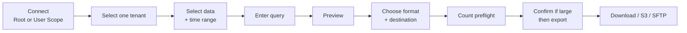

<h1 align="center">Stellar Data Exporter</h1>

<p align="center">
  <strong>Query Stellar Cyber raw data and export it safely to CSV, JSON, NDJSON, S3-compatible storage, or SFTP.</strong>
</p>

<p align="center">
  A browser-based export utility for analysts, engineers, and administrators who need more control than a one-off API script.
</p>

<p align="center">
  <a href="https://xdr.ooo/products/stellar-data-exporter">Product Page</a> ·
  <a href="https://xdr.ooo/products/stellar-data-exporter-guide">User Guide</a> ·
  <a href="https://github.com/xdr-labs/stellar-data-exporter/issues">Issues</a>
</p>

<p align="center">
  
  
  
  
</p>

---

## Query once. Preview first. Export where you need it.

Stellar Data Exporter provides a Web UI for searching Stellar Cyber raw data across one or more data sources, previewing the result, and exporting it without writing a custom script for every request.

| Capability | What it provides |
|---|---|
| **Credential modes** | Root Scope All-Access Token or User Scope API Key |
| **Multi-source query** | Select one or more friendly Stellar Cyber data sources; internal indices are resolved automatically |
| **Query modes** | Elasticsearch DSL and Stellar Cyber/Lucene query syntax |
| **Managed time range** | Start/end time is injected automatically into the effective query |
| **Preview** | Validate the query and inspect matching records before exporting |
| **Export formats** | CSV, JSON Array, or NDJSON |
| **Destinations** | Browser download, S3-compatible object storage, or SFTP |
| **Large exports** | Adaptive time slicing, record limits, gzip, file splitting, progress, cancellation, and retry/resume |
| **Operator workflow** | Saved non-secret profiles, query history/favorites, export history, and optional scheduled remote exports |

## Workflow



## Everyday workflow

1. Open the exporter and authenticate with the UI account. The development default is `stellar` / `stellar`.
2. Enter the Stellar Cyber host and choose the credential type you were issued.
3. Run **Test connection**, then select exactly one accessible tenant.
4. Select one or more data sources and the time range.
5. Enter an Elasticsearch DSL or Stellar Cyber query.
6. Run **Preview** and confirm the matching records.
7. Choose CSV, JSON, or NDJSON and the destination.
8. Click **Run export**. The exporter performs a count-only preflight before creating the export job.
9. If the matched count is large, review the performance warning and explicitly confirm before the export starts.

For the full operator walkthrough, see the **[Stellar Data Exporter User Guide](https://xdr.ooo/products/stellar-data-exporter-guide)**.

## Credential types

| Mode | Input | Query behavior |
|---|---|---|
| **Root Scope** | Account email + All-Access Token | Supports Elasticsearch DSL and Stellar Cyber Query |
| **User Scope** | User API Key | Uses Stellar Cyber Query (Lucene) mode for raw-data query/export |

Both flows exchange the supplied credential for a short-lived Stellar Cyber access token and refresh it automatically when needed.

> User Scope is not treated as a reduced “preview-only” mode. It is supported for raw-data search and export through the User API Key flow.

## Quick start

Requirements:

- Python 3.12+
- [uv](https://docs.astral.sh/uv/) recommended

From a source checkout:

```bash
git clone https://github.com/xdr-labs/stellar-data-exporter.git
cd stellar-data-exporter

uv sync --frozen
uv run stellar-data-exporter
```

The packaged launcher binds to `127.0.0.1:8787` by default.

Open:

```text
http://127.0.0.1:8787
```

The application requires HTTP Basic Auth on the UI and API. The development defaults are
`stellar` / `stellar`. Override them with `STELLAR_EXPORTER_UI_USERNAME` and
`STELLAR_EXPORTER_UI_PASSWORD` before an Internet-reachable deployment.

Check the service:

```bash
curl http://127.0.0.1:8787/api/health
```

Development HTTPS is also available:

```bash
./scripts/generate-dev-cert.sh
./scripts/run-dev-https.sh
```

Then open `https://localhost:8787`.

## Query modes

### Elasticsearch DSL

Available with Root Scope credentials.

```json
{
  "query": {
    "term": {
      "event_status": "New"
    }
  }
}
```

The exporter adds the selected time range around the user query.

### Stellar Cyber Query

Uses the Lucene-style query syntax familiar from Stellar Cyber search.

```text
event_status:New AND srcip:10.0.0.*
```

User Scope API Key mode selects this query mode automatically.

## Output and destinations

| Area | Options |
|---|---|
| Format | CSV, JSON Array, NDJSON |
| File controls | gzip, record limit, selected fields, numbered file splitting |
| Browser | Direct download; split downloads can be bundled as ZIP |
| Object storage | AWS S3, Cloudflare R2, MinIO, and other S3-compatible targets |
| SFTP | Password or SSH private-key authentication |

Advanced mode exposes tuning controls such as field selection, delimiter/header options, maximum file size, target records per slice, overlap policy, and remote-destination details.

## Large export behavior

The exporter uses half-open time ranges and adaptive slicing to avoid sending one oversized raw-data request for a large time window.

Before any interactive export job is created, the exporter runs a count-only preflight scoped to the selected tenant, data sources, time range, and query. Large matches require explicit confirmation before the export begins. The default warning threshold is 100,000 records and the critical threshold is 1,000,000 records; both are configurable with environment variables.

It can also:

- show live records/bytes/query/retry progress
- cancel active exports
- preserve sanitized job history
- resume supported remote exports from verified split-part checkpoints
- suppress duplicates only when Stellar/Elasticsearch provides stable document identity
- reject overlapping scheduled/advanced exports when configured

## Security boundary

- The UI and API require HTTP Basic Auth by default; only `/api/health` is unauthenticated.
- The development login defaults to `stellar` / `stellar`; override it with `STELLAR_EXPORTER_UI_USERNAME` and `STELLAR_EXPORTER_UI_PASSWORD` before production exposure.
- Stellar Cyber credentials are used only after the user selects exactly one accessible tenant; Preview, count, export, resume, and schedules remain tenant-scoped.
- Credentials are excluded from browser-saved profiles and persistent job history.
- One-time credentials are held in memory for normal interactive exports.
- TLS verification is enabled by default.
- Scheduled remote exports require encrypted credential storage; provide a production master key when using this feature.
- The shared Basic Auth gate is not a per-user authorization or multi-user isolation layer.
- Do not expose the development Uvicorn listener directly to the public Internet.

For production-oriented Nginx/systemd guidance, see [docs/PRODUCTION.md](docs/PRODUCTION.md).

## Documentation

- **Product page:** https://xdr.ooo/products/stellar-data-exporter
- **User guide:** https://xdr.ooo/products/stellar-data-exporter-guide
- **Production deployment:** [docs/PRODUCTION.md](docs/PRODUCTION.md)
- **Source:** https://github.com/xdr-labs/stellar-data-exporter

## Development

Run the test suite:

```bash
uv run --extra dev pytest -q
node --check app/static/app.js
```

The project follows the shared DataRelay Labs Engineering System adoption rules in `AGENTS.md` and `.engineering/`.

---

<p align="center">
  <strong>Select the data. Preview the query. Export the result.</strong>
</p>
